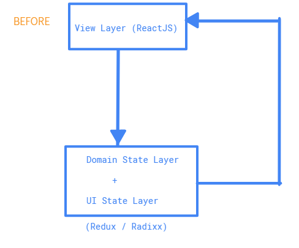
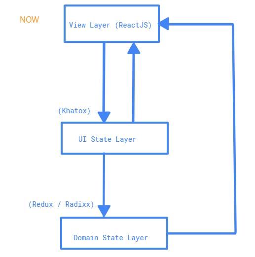

# kahtox
A small JavaScript library based on state machines (but not entirely) for isolating and managing its own UI-state (transient / non-persisted) layer while controlling a Domain-state (non-transient / persisted) layer like Redux, Radixx.

## Inspiration

This work was inspired by earlier works by [David K. Piano](https://twitter.com/davidkpiano) on [**xstate**](https://github.com/davidkpiano/xstate) and [Krasimir Tsonev](http://krasimirtsonev.com/) on [**stent**](https://github.com/krasimir/stent). Drawing from their work and thinking deeply about the problem, it was now clear that there needed to be a paradigm shift in the way we approached state management. *Xstate* for me is neat and helpful but is also too verbose and seeks to replace *Redux*. I have all these lingua and terminilogy like (Sequence, History, Orthogonal, Events, States, Effects, Guard) that i have to learn to make sense of it all. *Stent* on the other hand is less verbose but however also seeks to replace *Redux* completely adds composability problems (how do you compose one or more state machines together ?) to its setup process.

Now, *Kahtox* still makes use of finite state machine graphs and transitions too but doesn't try to replace libraires like *Redux* or *Radixx* but seeks to work along side these libraires. The reason for this is that UI state is NEVER meant to be stored in any state container because it is TRANSIENT and is totally irreleveant after a record of its occurence. UI state doesn't also need to be tracked for changes. Only Domain state needs to be stored in a state container and tracked for changes over time.

By seperating both state types into their respective layers and having one (UI state) control the other (Domain state), it becomes easier to manage outcomes and enforce guards for user interface interactions.

## Motivation

The need to separate today's monolith state management layer architecure into a more managable set of layers (2 of them actually)

1. UI State Layer (Transient / Non-Persisted)
2. Domain State Layer (Non-Transient / Persisted)

This need is long ovedue. state management libraries like Redux were under too much pressure to manage both UI State (which actually doesn't need to be persisted) and Domain state (which is actually meant to be put into a state container and persisted across web sessions)

However, this hasn't happened because everything is still built around verbosity and replacement. The idea is not to seek to replace Redux (even though [redux could be better redesigned](https://hackernoon.com/redesigning-redux-b2baee8b8a38)) but to reduce the amount of "useless work" that libraries like *Redux* are doing - which is tracking UI State in the store state container.

## Concepts

>Reusability of State Graphs & Sub State Graphs

When state graphs are created, it should be created with reusability in mind. For instance, a state graph can be reduced into 2 or more sub state graphs.

>State Graphs Should NEVER Depict Side-Effects Or Its Causality

Whenever your application goes into an error-state (Form Validation Errors, HTTP Errors), state graphs should NEVER ever deal with these situation. It should also never depict it as a state.

>Isolating Domain State Containers From Unecessary View Layer (UI) Update Info Storage

UI state is never meant to be tracked or persisted in a state container. UI state is only useful immediately before it causes a view re-render or view layer update. After that, it is no longer useful.

>UI State Changes Should Trigger View Layer (UI) Updates / Re-renders

UI state changes (driven by state graphs) will mostly trigger view updates except when the state is going back to the `$initial` state. In other words, state graphs MUST always be unidirectional (directed) circular graphs which circle back to the `$initial` state.

## Architecture

In time past, when building web apps, we made use of *Redux* or *Radixx* as both a **UI State Layer library** and a **Domain State Layer library**. This unfortunately created a lot of jank with the *redux* state tree and made it difficult to use the **UI State** the way it ought to be used. However, these days, we separate the 2 **State Layers** making way for *Redux* or *Radixx* to only be used for the **Domain State Layer** and *Kahtox* to be used for the **UI State Layer**. See below:

>BEFORE


>NOW


| BEFORE                    | NOW	                |
| ------------------------- | ------------------------- |
|   |      |

## Getting Started

> filename: Button.js
```js
import React, { Component } from 'react';

class Button extends Component {
	constructor(props){
		super(props);
	}
	
	render(){
		const type = this.props.type || 'button';
		const text = this.props.text;
		const disabled = this.props.disabled;
		const onButtonClick = this.props.onButtonClick || () => true;
		return (
			disabled === true 
			? <button type={type} disabled="disabled" onClick={onButtonClick}>{text}</button>
			: <button type={type} onClick={onButtonClick}>{text}</button>
		);
	}
}

export default Button;
```

> filename: Input.js
```js
import React, { Component } from 'react';

class Input extends Component {
	constructor(props){
		super(props);
	}
	
	render(){
		const type = this.props.type || 'text';
		const value = this.props.value || '';
		const name = this.props.name;
		const onInputChange = this.props.onInputChange || (e) => true;
		const onInputKeyDown = this.props.onInputKeyDown || (e) => true;
		
		return (
			(type === 'checkbox' || type === 'radio' || type === 'hidden')
			? <input type={type} name={name} value={value} onChange={onInputChange} />
			: <input type={type} name={name} value={value} onChange={onInputChange} onKeyDown={onInputKeyDown} />
		);
	}
}

export default Input;
```

> filename: FormBox.js
```js
import React, { Component, Children, cloneElement } from 'react';
import kahtox from 'kahtox';

const validateFormGuard = function ({ payload }){
	return payload.reduce(
		(val, acc) => (
			val.text.length !== 0 && val.status === 'pristine' && acc
		), 
		true
	)
};

let stateGraph = {
	$initial: 'empty',
	states: {
		'empty': {
			'input-keys': {
				nextState: 'filling',
				action: null,
				notifyView: false
			}
		},
		'filling': {
			'input-keys': {
				nextState: 'filling',
				action: null,
				notifyView: false
			},
			'input-change': {
				nextState: 'filling',
				action: null
			},
			'mouse-over-button': {
				nextState: 'filled',
				action: null,
				guard: validateFormGuard
			},
			'tab-into-button': {
				nextState: 'filled',
				action: null,
				guard: validateFormGuard
			}
		},
		'filled': {
			'button-click': {
				nextState: 'empty',
				action: null
			}
		}
	}
};

const getUTF8StringSize = (str) => {
	let sizeInBytes = str.split('')
	    .map(function( ch ) {
	      return ch.charCodeAt(0);
	    }).map(function( uchar ) {
	      // The reason for this is explained later in
	      // the section “An Aside on Text Encodings”
	      return uchar < 128 ? 1 : 2;
	    }).reduce(function( curr, next ) {
	      return curr + next;
	    }, 0);   
  	return sizeInBytes;
};

const debounce = (func, wait, immediate) => {
	let timeout;
	return function() {
		let context = this;
		let args = arguments;
		this later = function() {
			timeout = null;
			if (!immediate) func.apply(context, args);
		};
		let callNow = immediate && !timeout;
		clearTimeout(timeout);
		timeout = setTimeout(later, wait);
		if (callNow) func.apply(context, args);
	};
};

class FormBox extends Component {
   constructor(prop){
	super(props);
	this.grapher = kahtox.makeGrapher(stateGraph)
	this.state = {
		mode: this.grapher.initial,
		parentMode: this.props.mode,
		elements: this.props.children
	}
	
	this.formInputs = {};
	
	this.grapher.afterTransition((mode, data, hasError) => this.setState(prevState => Object.assign(prevState, { mode })))
	this.debounced = debounce(function(e, self) {
		let regexp = new RegExp(e.target.getAttribute('data-pattern'));
   		if(!regexp.test(self.formInputs[e.target.name].text)){
			self.formInputs[e.target.name].status = 'error';
		}
		self.grapher.dispatch('input-keys');
	}, 3400);
   }
   
   componentDidMount(){
   	;
   }
   
   onInputKeys(e){
   	this.formInputs[e.target.name] = { text:e.target.value, status: 'dirty' };
   	this.debounced(e, this)
   }
   
   onInputChange(e){
   	this.formInputs[e.target.name] = { text:e.target.value, status:e.target.getAttribute('data-input-status') };
	this.grapher.dispatch('input-change');
   }
   
   render(){
   	const mode = this.state.mode;
	const parentMode = this.props.mode;
	const handleSubmit = this.props.handleSubmit;
	const children = this.state.children;
	
	let addListeners = false;
	let childInputProps = {
	
	};
	let childButtonProps = {
	
	};
	
	if(parentMode == 'idle')
		addListeners = true;
		
	if(addListeners){
		childInputProps = {
			onInputChange: this.onInputChange.bind(this),
		      	onInputKeyDown: this.onInputKeys.bind(this)
		};
		
		childButtonProps = {
			onButtonClick: (e) => {
				this.grapher.dispatch('button-click')
				handleSubmit(this.formInputs);
			}
		}
	}
	
	return (
	<div className="formWrapper">
	{/* https://mxstbr.blog/2017/02/react-children-deepdive/ */}
	{(parentMode === 'before-send') && <h3>Please Wait....</h3>}
	{(parentMode === 'sending') && <h3>Sending To Server...</h3>}
	{(mode === 'empty') && <form name={name} method={this.props.method.toLowerCase()}>
		Children.map(children, (child, i) => {
			if(child.type === 'text' || child.type === 'checkbox') {
				this.formInputs[child.name] = { text: child.value, status: 'pristine' };
				childInputProps.name = child.name;
				childInputProps.type = child.type;
				childInputProps.value = child.value;
				return cloneElement(child, childInputProps);
			}else if(child.type === 'button' && (Children.count(children) === i + 1)){
				childInputProps.text = child.text;
				childInputProps.type = child.type;
				return cloneElement(child, childButtonProps);
			}
		})</form>}
	
	{(mode === 'filling' || mode === 'filled') && <form name={name} method={this.props.method.toLowerCase()}>
		Children.map(children, (child, i) => {
			childInputProps.value = this.formInputs[child.name].text;
			childInputProps.status = this.formInputs[child.name].status;
			if(child.type === 'text' || child.type === 'checkbox') {
				childInputProps.name = child.name;
				childInputProps.type = child.type;
				childInputProps.value = child.value;
				return cloneElement(child, childInputProps);
			}else if(child.type === 'button' && (Children.count(children) === i + 1)){
				childInputProps.text = child.text;
				childInputProps.type = child.type;
				return cloneElement(child, childButtonProps);
			}
		}) </form>}
		</div> );
   }
}

export default FormBox;

```

> filename: TodoList.js
```js
import React, { Component } from 'react';
import kahtox from 'kahtox';

class TodoList extends Component {
	constructor(props){
		super(props);
	}
	
	render(){
		const todos = this.props.todos;
		const parentMode = this.props.mode;
		
		return (
			<div className="todoWrapper">
				{(parentMode === 'before-fetch') && <h3>Please Wait...</h3> }
				{(parentMode === 'fetching') && <h3>Fetching From Server...</h3> }
				<ul>
				{(parentMode === 'idle' && todos.length !== 0) && todos.map(function(todo){
					return (<li><h3>{todo.title}</h3><p>{todo.desc}</p></li>);
				})}
				{(parentMode === 'idle' && todos.length === 0) && <li><span>You have no Todos!</span></li>}
				</ul>
			</div>
		);
	}
}

export default TodoList

````

> filename: TodoApp.js
```js
import React, { Component } from 'react';
import ReactDOM from 'react-dom';
import kahtox from 'kahtox';
import thunk from 'redux-thunk';
import { createStore, applyMiddleware } from 'redux';

import Button from './Button.js';
import Input from './Input.js';
import FormBox from './Formbox.js';
import TodoList from './TodoList.js';


function makeHttpRequestAndUpdate( payload, grapher, meta ) {
  // Invert control!
  // Return a function that accepts `dispatch` so we can dispatch later.
  // Thunk middleware knows how to turn thunk async actions into actions.
  return function() {
    grapher.dispatch('http-req')
    let url = payload.url;
    delete payload.url;
    return fetch(url, payload).then(
      data => {
      	grapher.dispatch('http-req-success', { todos: data });
      },
      error => {
	grapher.dispatch('http-req-failure', error);
      }
    )
  }
}

let stateGraph = {
   $initial: 'idle',
   states:{
	   'idle': {
		send:{ // HTTP POST, PUT, PATCH, DELETE
			nextState: 'before-send',
			action: '#thunk'
		},
		fetch:{ // HTTP GET, HEAD
			nextState: 'before-fetch',
			action: '#thunk'
		}
	   },

	   'before-fetch': {
		'http-req': { 
			nextState:'fetching',
			action: null
		}
	   },

	   'before-send': {
		'http-req': {
			nextState:'sending',
			action: null
		}
	   },

	   'fetching':{
		'http-req-success':{
			nextState: 'idle',
			action: 'LOAD_TODOS'
		},
		'http-req-failure':{
			nextState: 'idle',
			action:null
		}
	   },

	   'sending': {
	       'http-req-success':{
			nextState: 'idle',
			action:'ADD_TODOS'
		},
		'http-req-failure':{
			nextState: 'idle',
			action:null,
			notifyView: true
		}
	   }
   }
};


let store = createStore(function todos(state = [], action) {
  switch (action.type) {
    case 'LOAD_TODO':
      return state.concat(action.todos);
    case 'ADD_TODO':
      return state.concat([action.todo])
    default:
      return state
  }
}, applyMiddleware(thunk));

class TodoApp extends Component {
   constructor(prop){
	super(props);
	this.grapher = kahtox.makeGrapher(stateGraph, (action, { payload, grapher, meta }) => { 
		switch(action){
		   case '#thunk':
			return store.dispatch(makeHttpRequestAndUpdate(payload, grapher, meta))
		   case 'LOAD_TODOS':
		       return store.dispatch({ type:action, todos: payload }) 
		   case 'ADD_TODO':
		       return store.dispatch({ type:action, todo: payload }) 
		}
	});
	this.state = {
 		mode: this.grapher.initial,
		parentMode: null,
		todos: store.getState()
	};
	
	let select = (state) => state.todos;
	
	store.subscribe(() => this.setState(prevState => Object.assign(prevState, { todos: select(store.getState()) })))
	this.grapher.afterTransition((mode, data) => {
		this.setState(prevState => Object.assign(prevState, { mode }))
	})
   }

   componentDidMount(){
	this.grapher.dispatch('fetch', { 
		url: 'https://localhost:4005/todos',  
		credentials: 'same-origin', 
		method: 'GET', 
		body: { perPage: 5, page:0 } 
	});
   }
   
   submitDataToServer(formData){
   	this.grapher.dispatch('send', { 
		url: 'https://localhost:4005/todos', 
		credentials: 'same-origin', 
		method: 'POST', 
		body:formData 
    	});
   }

   render(){
	const mode = this.state.mode;
	const todos = this.state.todos;

	return (
		{(mode === 'idle') && <FormBox name="todos" method="POST" mode={mode} handleSubmit={this.submitDataToServer.bind(this)}>
		   <Input readonly=false name="todoTitle" value="" type="text" />
		   <Input readonly=false name="todoDesc" value="" type="text" />
		   <Input readonly=false type="checkbox" name="todoComplete" value="" />
		   <Button type="button" disabled={false} text="ADD" />
		</FormBox> <hr /> <TodoList todos={todos} mode={mode} /> }
		{(mode === 'before-send' || mode === 'before-fetch') && <FormBox name="todos" method="POST" mode={mode} handleSubmit={this.submitDataToServer.bind(this)}>
		   <Input readonly=false name="todoTitle" type="text" />
		   <Input readonly=false name="todoDesc" type="text" />
		   <Input readonly=false type="checkbox" name="todoComplete" />
		   <Button type="button" disabled={true} text="ADD" /> {/* Disable the button so submit event can't be triggere again */}
		</FormBox> <hr /> <TodoList todos={todos} mode={mode} /> }
		{(mode === 'sending' || mode === 'fetching') && <FormBox name="todos" method="POST" mode={mode}>
		   <Input readonly=true name="todoTitle" type="text" /> 
		   <Input readonly=true name="todoDesc" type="text" />
		   <Input readonly=true type="checkbox" name="todoComplete" /> 
		   <Button type="button" disabled={true} text="ADD" /> {/* Disable the entire form */}
		</FormBox> <hr /> <TodoList todos={todos} mode={mode} /> }
	)
   }
}

ReactDOM.render(<TodoApp />, document.body);
```

## License

MIT

## Contributing
